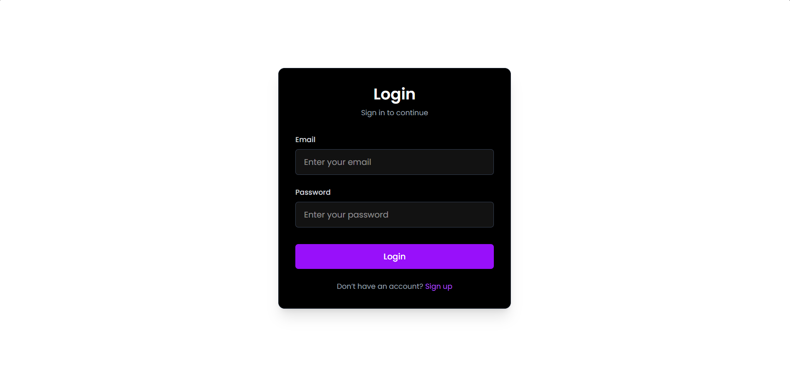
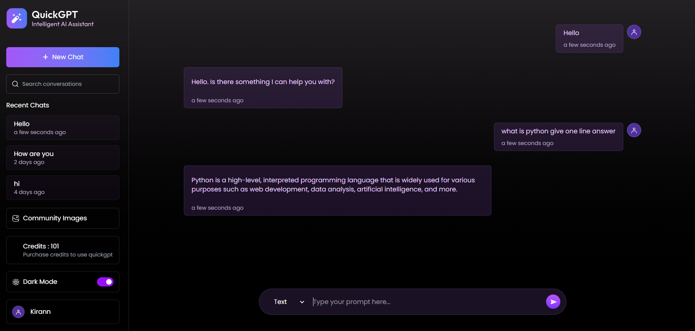
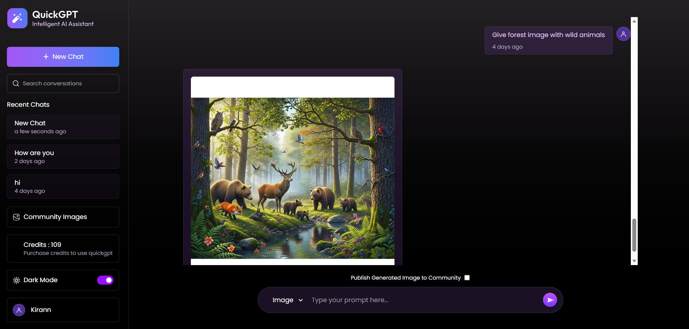
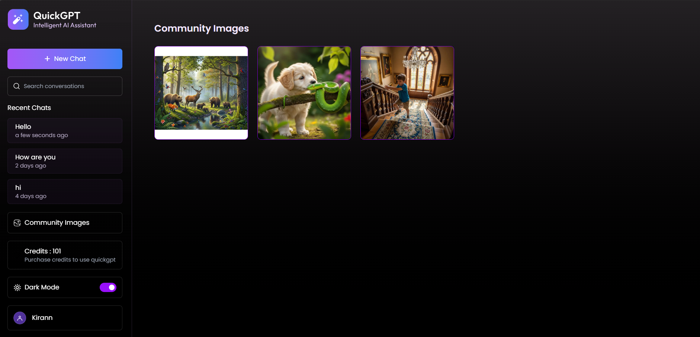
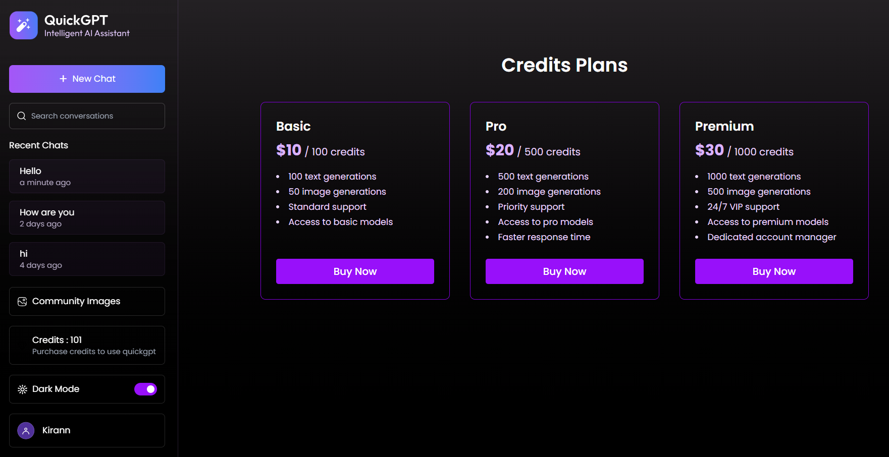

ChatbotAI Platform

🚀 AI-Powered Full-Stack Application built with MERN Stack

A modern AI Chatbot Platform that allows users to generate AI-powered text and images, manage AI usage through a credit-based system, and purchase additional credits using Razorpay.

🔗 <a href="https://chatbotai-99.vercel.app">Live Demo</a>
 

---

✨ Project Preview

🔐 Login & Authentication

Secure user login and registration system.

💬 AI Chatbot

Generate AI-powered text responses using the Groq API.

🖼️ AI Image Generation

Generate images from natural-language prompts.

🌐 Community Images

View AI-generated images shared with the community.

💳 Credit Plans

Purchase additional credits through Razorpay.

---

🔥 Key Features

- 🤖 AI Text Generation using Groq API
- 🖼️ AI Image Generation
- 💬 Interactive AI Chatbot
- 🔐 User Authentication & Authorization
- 💰 Credit-Based Usage System
- 💳 Razorpay Payment Integration
- 🌐 Community Image Sharing
- 📜 Generated Content Management
- 📱 Responsive User Interface
- ⚡ REST API Communication
- ☁️ Full-Stack Deployment on Vercel

---

🛠️ Tech Stack

🎨 Frontend

"React.js" (https://img.shields.io/badge/React.js-61DAFB?style=for-the-badge&logo=react&logoColor=black)
"JavaScript" (https://img.shields.io/badge/JavaScript-F7DF1E?style=for-the-badge&logo=javascript&logoColor=black)
"CSS" (https://img.shields.io/badge/CSS-1572B6?style=for-the-badge&logo=css3&logoColor=white)
"Axios" (https://img.shields.io/badge/Axios-5A29E4?style=for-the-badge)

⚙️ Backend

"Node.js" (https://img.shields.io/badge/Node.js-339933?style=for-the-badge&logo=node.js&logoColor=white)
"Express.js" (https://img.shields.io/badge/Express.js-000000?style=for-the-badge&logo=express)

🗄️ Database

"MongoDB" (https://img.shields.io/badge/MongoDB-47A248?style=for-the-badge&logo=mongodb&logoColor=white)
"Mongoose" (https://img.shields.io/badge/Mongoose-880000?style=for-the-badge)

🤖 AI Services

"Groq API" (https://img.shields.io/badge/Groq%20API-000000?style=for-the-badge)
"ImageKit" (https://img.shields.io/badge/ImageKit-5A67D8?style=for-the-badge)

💳 Payment Gateway

"Razorpay" (https://img.shields.io/badge/Razorpay-3395FF?style=for-the-badge&logo=razorpay&logoColor=white)

☁️ Deployment

"Vercel" (https://img.shields.io/badge/Vercel-000000?style=for-the-badge&logo=vercel&logoColor=white)

---

🏗️ Application Architecture

                         👤 USER
                            │
                            ▼
                   ┌─────────────────┐
                   │  React Frontend │
                   └────────┬────────┘
                            │
                         REST API
                            │
                            ▼
                   ┌─────────────────┐
                   │ Node.js +       │
                   │ Express.js      │
                   └───────┬─────────┘
                           │
              ┌────────────┼────────────┐
              │            │            │
              ▼            ▼            ▼
          MongoDB       Groq API     ImageKit
           Atlas       AI Text       AI Images
              │
              │
              ▼
          User Credits
              │
              ▼
          Razorpay
           Payment

---

🔄 How It Works

🤖 AI Text Generation

User Prompt
     ↓
React Frontend
     ↓
Express REST API
     ↓
Groq API
     ↓
AI Response
     ↓
Frontend

🖼️ AI Image Generation

Image Prompt
     ↓
React Frontend
     ↓
Express REST API
     ↓
Image Generation Service
     ↓
Generated Image
     ↓
Frontend

💳 Credit & Payment System

New User
    ↓
Free Credits
    ↓
Use AI Features
    ↓
Credits Deducted
    ↓
Credits Become Low / Zero
    ↓
Select Credit Plan
    ↓
Razorpay Payment
    ↓
Credits Added
    ↓
Continue Using AI

---

💡 Why This Project?

This project combines multiple real-world software development concepts:

MERN + AI + REST APIs + Authentication + Database + Payment Gateway + Credit System + Cloud Deployment

Instead of building only a basic CRUD application, this project helped me understand how different services can work together to create a complete full-stack product.

---

🎯 Interview Highlights

Key Technical Areas

Area| Technology
Frontend| React.js
Backend| Node.js + Express.js
Database| MongoDB Atlas
AI Text| Groq API
AI Images| ImageKit
Payments| Razorpay
API Communication| Axios / REST APIs
Deployment| Vercel

What I Learned

- Full-stack MERN development
- REST API development
- MongoDB & Mongoose
- Authentication & authorization
- External API integration
- AI API integration
- Payment gateway integration
- Credit-based business logic
- Environment variable management
- Error handling
- Frontend-backend communication
- Full-stack deployment

---

🚀 Future Improvements

- 💬 Save complete chat history
- 📜 AI conversation history
- 🖼️ Download generated images
- 👤 User profile management
- 🌍 Multi-language support
- 🎙️ Voice input
- 🔊 AI voice responses
- 🌙 Dark mode improvements
- 📝 Advanced prompt templates
- 📊 User usage analytics

---

⚙️ Installation

Clone the Repository

git clone https://github.com/thekiran15/ChatbotAI.git

Navigate to the Project

cd ChatbotAI

Install Dependencies

npm install

Configure your required environment variables:

MongoDB
Groq API
ImageKit
Razorpay

Then start the frontend and backend according to your project configuration.

---

👨‍💻 Author

Kiran S B

Computer Science Engineering Student | Full-Stack Developer

Interested in Software Development, Full-Stack Development, AI Applications and Problem Solving.

---

⭐ If you found this project interesting, consider giving it a star!

🚀 Built with MERN + AI + Razorpay

